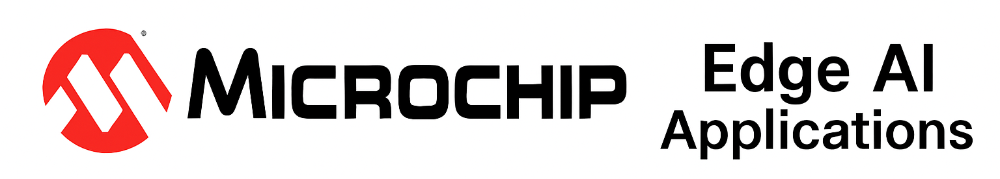

  

# Edge AI Applications

# Edge AI Applications Repository

This repository serves as the primary hub for Microchip’s Edge AI application portfolio. It highlights how artificial intelligence and machine learning can be efficiently deployed on resource-constrained MCUs, MPUs, and FPGAs, spanning real-world use cases across vision, audio, predictive maintenance, human–machine interfaces (HMI), and electrical systems.

The objective of this repository is to:

- Provide reusable reference applications that developers can adapt for their own designs
- Demonstrate best practices for deploying AI/ML models on Microchip platforms
- Showcase cross-platform support across dsPIC®, PIC32, SAM MPUs, and PolarFire® SoCs
- Act as a central knowledge base for development teams, customers, and ecosystem partners building Edge AI solutions

For more information on Microchip’s Edge AI technology and ecosystem, visit:
**[Microchip Edge AI](https://www.microchip.com/en-us/solutions/technologies/machine-learning)**

---

## 🔹 Application Categories

### 1. Vision Applications
Vision is one of the fastest-growing areas in EdgeAI. These applications use cameras or image sensors to enable devices to see and interpret their environment.  
Typical challenges include **low-power image capture**, **real-time inference**, and **memory-efficient neural networks**.

Example use cases:
- **Smart Home**
- **Parking lot**
- face recognition
- Person detection
- Object recognition
- License Plate Detection

---

### 2. Audio Applications
Audio-based AI enables devices to listen, understand, and react to sound inputs. These solutions are highly relevant for **hands-free control, monitoring, and assistive technologies**.  
The main challenges are achieving **always-on low-power listening** and **robustness across noisy environments**.

Example use cases:
- **[Keyword spotting (KWS)](https://developerhelp.microchip.com/xwiki/bin/view/applications/machine-learning/edge-impulse-keyword-spotting/)** – detecting short commands like “Hey Microchip” or “Start”.  
- **[Sound recognition](https://developerhelp.microchip.com/xwiki/bin/view/applications/machine-learning/mlsound/)** – recognizing events such as glass breaking, alarms, or machinery noise.  

---

### 3. Predictive Maintenance Applications
Predictive Maintenance (PdM) brings intelligence to industrial and IoT systems by monitoring equipment health in real-time. Instead of waiting for machines to fail, AI detects early signs of degradation, reducing downtime and cost.  
These applications often use **vibration, current, and acoustic signals** as inputs.

Example use cases:
- **[Fan Condition Monitoring](https://github.com/MicrochipTech/ml-Coffee-Powder-Brand-Classification-GasSensor)** – identifying early signs of mechanical stress.  
- **[Motor Control AI/ML Predictive Maintenance Demonstration Application](https://www.microchip.com/en-us/tools-resources/reference-designs/motor-control-ai-ml-predictive-maintenance-demonstration-application-1)** – detecting imbalance, misalignment, or efficiency loss.  
- **Compressor condition monitoring** – catching leaks or pressure drops before failure.  

---

### 4. Human–Machine Interface (HMI) Applications
HMI solutions enhance how users interact with devices by making interfaces more **natural, intuitive, and responsive**. AI-powered HMIs go beyond simple buttons, enabling **gesture, touchless, and multimodal interactions**.

Example use cases:
- **[Gesture recognition](https://github.com/MicrochipTech/ml-samd21-iot-mplabml-gestures-demo)** – enabling gesture recognition in consumer electronics or automotive.  
- **[Gesture recognition using dsPIC](https://github.com/MicrochipTech/ml-samd21-iot-mplabml-gestures-demo)** – gesture recognition on dsPIC device

---
### 5. Gas Sensing Applications

Gas and air-quality sensing is an emerging area in Edge AI where sensor fusion and machine learning enable devices to detect, classify, and respond to chemical signatures in real time. These applications can run on low-power MCUs and are relevant across industrial, consumer, and environmental domains.

Example use cases:

- **[Coffee bean classification](https://github.com/MicrochipTech/ml-Coffee-Powder-Brand-Classification-GasSensor)** – distinguishing brands, roast level, freshness, or origin
---

### 6. Electrical Applications
Electrical signal monitoring is critical in industrial and residential environments. AI enhances traditional electrical sensing by detecting subtle patterns and anomalies that rule-based systems may miss.  
This category includes **safety, efficiency, and grid-monitoring applications**.

Example use cases:
- **[Arc fault detection](https://github.com/MicrochipTech/ml-arc-fault-detection)** – identifying hazardous sparks in power lines or appliances.  
- **[Smart metering & anomaly detection](https://www.microchip.com/en-us/tools-resources/reference-designs/smart-meter-load-disaggregation-using-a-machine-learning-model-demo-app)** – predicting faults or abnormal electrical behavior.  

---
7. Wearables & Activity Monitoring

This category includes motion, posture, gesture, and human-activity–based Edge AI applications. These solutions typically use IMUs, accelerometers, or multimodal sensing to enable intelligent fitness, safety, and health monitoring on-device.

Example use cases:

- **[Smart Dumbbell](https://github.com/MicrochipTech/ml-PIC33CX-BZ2-and-WBZ451-IMU-SmartBell)** – classifying reps, posture, and movement quality
- **[Fall Detection](https://github.com/MicrochipTech/ml-PIC33CX-BZ2-and-WBZ451-IMU-SmartBell)** – detecting and alerting on human falls using embedded ML

---
## 🖥 Supported Platforms

The applications in this repository are designed to run across Microchip’s broad compute portfolio, covering:

- **[MCUs](https://www.microchip.com/en-us/products/microcontrollers)** – Ultra-low-power and real-time devices suited for always-on sensing and lightweight ML inference
- **[MPUs](https://www.microchip.com/en-us/products/microprocessors)** – Application-class processors with Linux support for higher-compute AI workloads
- **[FPGAs and SoC FPGAs](https://www.microchip.com/en-us/products/fpgas-and-plds)** – Configurable logic and RISC-V–based platforms for accelerated AI processing
- **[dsPIC-DSC](https://www.microchip.com/en-us/products/microcontrollers/dspic-dscs)**– Devices optimized for signal processing and deterministic control workloads
---

## 🛠 Toolchains & Build Support

This repository supports multiple build flows, including:  

- **[MPLAB X IDE](https://www.microchip.com/en-us/tools-resources/develop/mplab-x-ide)** with XC compilers for MCUs.
- **[MPLAB Machine learning Development Suite](https://www.microchip.com/en-us/tools-resources/develop/mplab-machine-learning-development-suite)** for machine learning model development
- **[Harmony Configurator (MHC)](https://www.microchip.com/en-us/tools-resources/configure/mplab-harmony)** for driver and middleware setup.  
- **[VectorBlox SDK](https://www.microchip.com/en-us/products/fpgas-and-plds/fpga-and-soc-design-tools/vectorblox)** for FPGA-based AI acceleration.
- **[TensorFlow to MPLAB Harmony V3 Model Converter](https://github.com/MicrochipTech/tf2mplabh3)** - enables you to convert TensorFlow models to C code, ready for seamless integration into your MPLAB® Harmony v3 embedded projects.

---

## 🔗 VectorBlox Reference

Edge AI deployments that require FPGA acceleration can leverage the
**[Microchip-VectorBlox GitHub repository](https://github.com/Microchip-Vectorblox)**
.
This repository provides toolflows, examples, and runtime support for ML inference on PolarFire® SoC and other FPGA-based platforms.

---

## 📚 Documentation

General documentation and guides will be found under: 

Planned docs:
- **Overview** of the repo  
- **Getting Started** guides per platform  
- **Roadmap** of upcoming apps  
- **FAQs & troubleshooting**

---

For bug reports, feature requests, or questions, please use the GitHub Issues section.

---

## 📜 License

